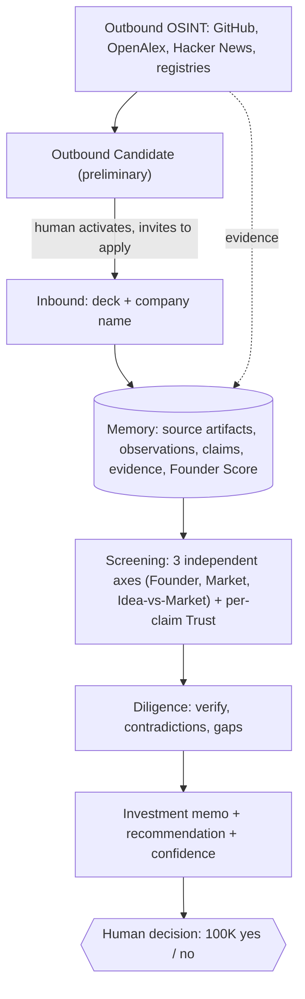

# FounderLookup: the VC Brain

An AI-first operating system for early-stage venture. It **sources** founders (inbound applications and outbound OSINT), **screens** each opportunity on three independent axes with per-claim trust, and hands a human investor an **evidence-backed, decision-ready recommendation** within 24 hours. It never moves money: a human makes the call.

> Hack-Nation x MIT, Challenge 02 "The VC Brain" (Maschmeyer Group).

## The flow



## Principles we don't compromise on

- **Three axes, never averaged.** Founder / Market / Idea-vs-Market stay independent, each with a trend.
- **Trust is per-claim.** Every assertion traces to evidence with a confidence level; contradictions surface before the investor sees them.
- **Founder Score persists.** A per-person, evidence-backed score that follows a founder across companies; one input to the Founder axis, never a replacement.
- **Cold-start is first-class.** Missing public history lowers coverage and confidence, never founder quality.
- **OSINT, done responsibly.** Many public sources, one cross-source-corroborated profile; public-only, terms-respecting, no deanonymization; a human reviews before any outreach.
- **Recommendation, not autonomous capital.** The system decides what to recommend; a human deploys the check.

## Architecture

Modular Python monolith, contract-first. The plan lives as an OpenSpec change at `openspec/changes/build-vc-brain-mvp`.

```
backend/src/founderlookup/
  domain/          # frozen, strict Pydantic contracts (evidence, scoring, discovery, ...)
  ingestion/       # Memory + provider-neutral source adapters (the OSINT palette)
  screening/       # thesis rules + framework-neutral intelligence
  api/             # FastAPI transport
  infrastructure/  # persistence, files, telemetry
```

Stack: Python + FastAPI + `uv` + SQLite. Plain-Python orchestration (no agent framework); the investment-intelligence model provider is gated. Mistral OCR handles deck extraction. Sourcing anchors free source-specific APIs (GitHub, OpenAlex, Hacker News) behind a provider-neutral seam built for later expansion.

## Getting started

```bash
cd backend
uv run pytest          # run the suite
uv run ruff check .    # lint
uv run mypy src        # type-check
cp .env.example .env   # then fill in local secrets
```

## Where things live

- `openspec/changes/build-vc-brain-mvp/` : proposal, design, tasks, and the four capability specs.
- `CONTEXT.md` : the ubiquitous domain language.
- `research/founder-traits.md` : the evidence base behind the founder-scoring rubric.
