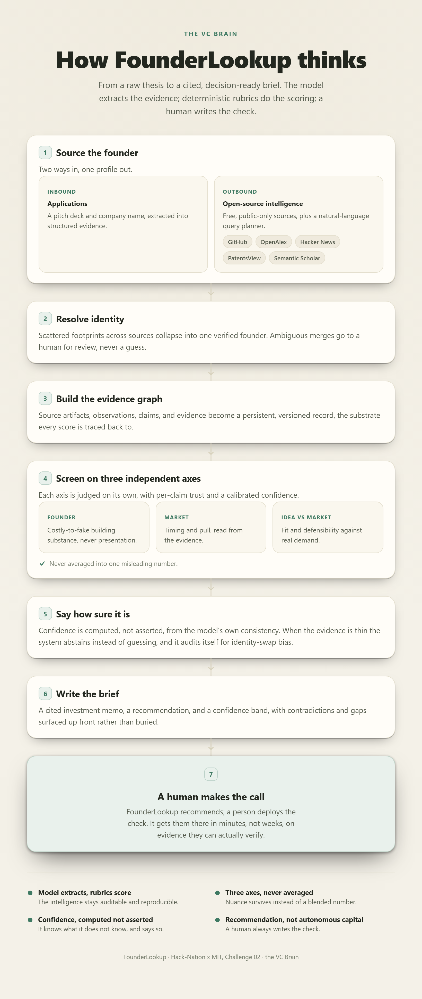

# FounderLookup: the VC Brain

An AI operating system for early-stage venture. It **sources** founders (inbound applications and outbound open-source intelligence), **screens** each opportunity on three independent axes with per-claim trust and calibrated confidence, and hands a human investor an **evidence-backed, decision-ready recommendation**. It never moves money: a human makes the call.

> Hack-Nation x MIT, Challenge 02 "The VC Brain" (Maschmeyer Group).

## What's built

The deterministic scoring and evidence core, durable inbound intake, and bounded outbound pipeline are implemented and covered by a network-free test suite. Live providers remain explicit opt-ins; skipped live checks are never described as passing.

- **Sourcing.** Tavily plus five public source-specific adapters (GitHub, OpenAlex, Hacker News, PatentsView, Semantic Scholar) sit behind provider-neutral ports. A thin LangGraph loop plans, retrieves/structures, assesses Evidence gaps, performs only bounded follow-up rounds, and records why it stopped.
- **Public showcase extraction.** Optional GPT-5.6 Luna strict Structured Outputs propose event/project/participant, repository/demo/deck, and public contact fields from already acquired PUBLIC pages. Deterministic code accepts only exact source-backed excerpts and safe URLs; participant identity stays unverified and model failure falls back safely.
- **Identity resolution.** Collapses one founder from many scattered footprints; ambiguous merges go to a human, never a guess.
- **The judge.** Claim-trust and founder-score rubrics, the three independent axes, and the builder-vs-fundability read that surfaces the exceptional builder a traditional screen filters out.
- **Confidence, computed not asserted.** Self-consistency dispersion, snap-vs-reasoned divergence, explicit abstention when evidence is thin, a counterfactual identity-swap bias check, and per-subgroup calibration.
- **Decision.** A conviction threshold and a candidate-keyed preliminary Assessment Envelope, plus an evaluation harness that scores rank agreement, confidence-band coverage, calibration, and lift over a baseline, on fixtures.
- **Inbound.** Company-name-plus-PDF intake, private artifact storage, founder-status capability, bounded Mistral OCR adapter, and five framework-neutral analysis interfaces are present. GPT-5.6 Luna has an optional reasoner adapter behind those interfaces; LangGraph is not part of the inbound domain contract.

## The flow



> The designed pipeline. Deterministic demo paths are self-contained; real Tavily, OpenAI, Mistral, and deployed-environment checks require explicit opt-in configuration.

## Principles we don't compromise on

- **The model extracts, the rubrics score.** The language model turns messy evidence into structured signals; deterministic, versioned rubrics do all the scoring. So the intelligence is auditable and reproducible, never a black box.
- **Three axes, never averaged.** Founder / Market / Idea-vs-Market stay independent, each with a trend.
- **Trust is per-claim.** Every assertion traces to evidence with a confidence level; contradictions surface before the investor sees them.
- **Confidence is honest.** The system reports how sure it is and abstains instead of guessing; missing history lowers coverage and confidence, never founder quality.
- **Founder Score is built to persist.** A per-person, evidence-backed, versioned score designed to follow a founder across companies (persistence via canonical Memory is aimed); one input to the Founder axis, never a replacement.
- **OSINT, done responsibly.** Many public sources, one cross-source-corroborated profile; public-only, terms-respecting, no deanonymization; a human reviews before any outreach.
- **Recommendation, not autonomous capital.** The system decides what to recommend; a human deploys the check.

## Architecture

Modular Python monolith, contract-first, developed spec-driven via OpenSpec (`openspec/changes/build-vc-brain-mvp`).

```
backend/src/founderlookup/
  domain/          # frozen, strict Pydantic contracts (evidence, scoring, discovery, ...)
  ingestion/       # provider-neutral source adapters, identity resolution, query planner
  screening/       # rubrics, three axes, confidence, conviction, evaluation, analysis seam
  api/             # FastAPI transport
  infrastructure/  # persistence, files, telemetry
```

Stack: Python + FastAPI + `uv` + SQLite, with React/TypeScript/Vite on the frontend. GPT-5.6 Luna is optional behind framework-neutral analysis/extraction seams; deterministic fakes and parsers remain the default fallback. LangGraph owns only the bounded outbound retrieval state machine. Mistral OCR is the optional deck page-extractor, and every provider is fail-closed behind server-side configuration. See `docs/adr/` for the recorded boundaries.

## Getting started

```bash
cd backend
uv run pytest          # run the suite (all green)
uv run ruff check .    # lint
uv run mypy src        # type-check
cp .env.example .env   # then fill in local secrets (OPENAI_API_KEY, MISTRAL_API_KEY)
```

## Live-demo and deploy gates

For the fastest self-contained presentation, run the frontend fixture described in
[`frontend/README.md`](frontend/README.md); it needs no provider, private deck, or network call.
For the HTTP-connected demo, start FastAPI, set the same investor credential in the backend and
the Vite proxy, and opt into fictional process-local data with:

```dotenv
FOUNDERLOOKUP_DEMO_SEED_ENABLED=true
```

Production mode additionally refuses that seed unless
`FOUNDERLOOKUP_DEMO_SEED_PRODUCTION_ACKNOWLEDGED=true`. This second flag acknowledges a visibly
fictional demo dataset; it is not permission to relabel fixtures as live evidence.

Real providers are independent opt-ins. Tavily needs its enable flag and key. GPT-5.6 Luna public
sourcing extraction additionally needs `FOUNDERLOOKUP_OPENAI_STRUCTURED_ENABLED=true`; that path
accepts only acquired PUBLIC artifacts even if generic private-analysis settings are enabled.
Founder-private Mistral OCR stays blocked unless the normal provider controls are confirmed or the
demo explicitly enables private transfer, a confirmed OCR purpose, and
`FOUNDERLOOKUP_MISTRAL_OCR_HACKATHON_PRIVATE_RISK_ACCEPTED=true`. The acknowledgement does not
claim training opt-out, Zero Data Retention, or a processing region.

Opt-in live checks require `FOUNDERLOOKUP_RUN_LIVE_TESTS=1` plus their documented credentials and
target URL. A skipped live test is not a pass. Railway/Docker commands and the same-origin
production proxy are documented in [`backend/README.md`](backend/README.md) and
[`frontend/README.md`](frontend/README.md).

## Where things live

- `openspec/changes/build-vc-brain-mvp/` : proposal, design, tasks, and the four capability specs.
- `docs/adr/` : architecture decision records (model provider, orchestration).
- `CONTEXT.md` : the ubiquitous domain language.
- `research/founder-traits.md` : the evidence base behind the founder-scoring rubric.
