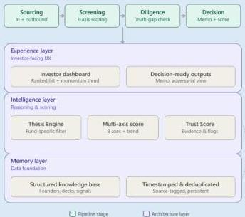

Hack-Nation

THE VC BRAIN · MASCHMEYER GROUP × Hack-Nation · Challenge Brief

MASCHMEYER GROUP

**Assessment & Intelligence — the reasoning layer.** Makes or supports every investment decision.

- Operates on top of Memory to produce insights, challenge assumptions, and recommend next steps.
- Triggered by an inbound application, or by signals crossing a conviction threshold on their own.
- Transparent about confidence, uncertainty, and the evidence behind every conclusion.

**Memory — the data foundation.** Nothing discarded.

- Ingests pitch decks, interviews, launches, GitHub activity, and social traction.
- Deduplicates, enriches, timestamps, and tags everything by source.
- Houses the Founder Score — persists across applications, never resets.
- Surfaces the trend over time, not just the latest snapshot.

VC Brain architecture: pipeline stages (Sourcing → Screening → Diligence → Decision) mapped onto the Memory, Intelligence, and Experience layers.

**The MVP should demonstrate:**

1. **Thesis Engine:** Investor sets sectors, stage, geography, check size, ownership targets, and risk appetite. Every recommendation is filtered and scored through this fund-specific lens.
2. **Smart Data Collection & Management:** Actively collect, validate, and structure founder and company data from heterogeneous sources — the data layer matters as much as the intelligence built on top of it.
3. **Multi-Attribute Reasoning:** Move beyond keyword search. Support complex, natural-language queries, e.g. “technical founder, Berlin, AI infra, enterprise traction, no prior VC backing, top-tier accelerator.”

Hack-Nation × MIT Club of Northern California × MIT Club of Germany · 6th Global AI Hackathon · Page 3