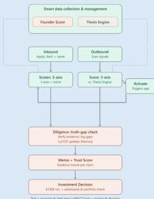

Hack-Nation

THE VC BRAIN · MASCHMEYER GROUP × Hack-Nation · Challenge Brief

MASCHMEYER GROUP

End-to-end flow from inbound and outbound sourcing through 3-axis screening, diligence, and the final investment decision.

### 3. Stretch Goals

We know that you can do it!

1. **Agentic Traceability:** Every recommendation must cite the exact data point — pitch deck slide, web signal, or interview excerpt — that drove the conclusion. If the system recommends a founder, it must show precisely what justified the Trust Score.

*Hint: implement step-level chain-of-thought logging to visualise the full reasoning process.*

2. **Self-Correction Loops:** Implement a Validator Agent that cross-references extracted founder claims against market databases, comparable funding rounds, and observable evidence to ensure the primary agent is not hallucinating.
3. **Sourcing & Network Intelligence:** Model the sourcing graph — the network of programs, institutions, and individuals through which promising founders become visible — and track which channels historically produce the strongest opportunities. Proactively suggest underexplored sourcing channels based on what has worked before, and once a founder converts into a funded deal, feed that outcome back into the model so it learns which channels generate quality, not just volume.

### 4. Areas of Research

Genuinely open problems. Solving them robustly could be industry-defining — document your approach if you crack one.

1. **Confidence Scoring:** Founder data is messy and incomplete. Can prediction intervals be built around soft-skill assessments like resilience or founder-market fit?

Hack-Nation × MIT Club of Northern California × MIT Club of Germany · 6th Global AI Hackathon · Page 5